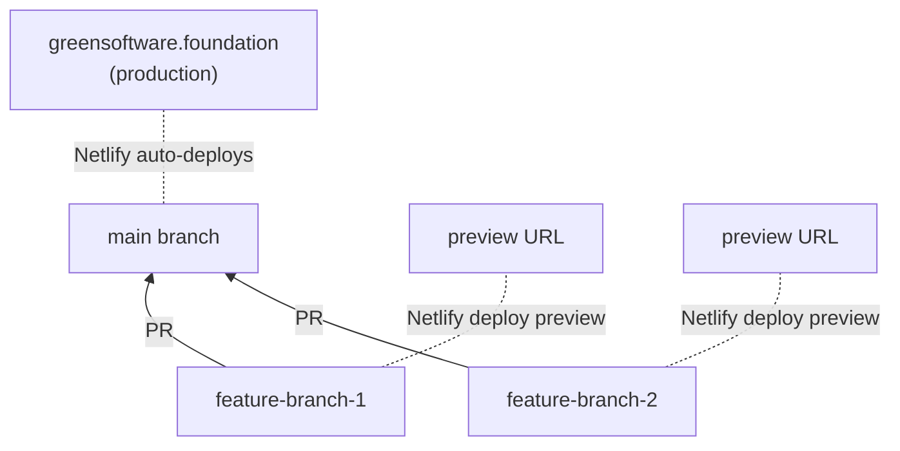

# Green Software Foundation Website

The official website for the [Green Software Foundation](https://greensoftware.foundation), built with Astro 5, React 19, and Tailwind CSS 4.

## Branching & Deployment



| Branch | Deploys to | Purpose |
|--------|-----------|---------|
| `main` | [greensoftware.foundation](https://greensoftware.foundation) | Production — protected, no direct pushes |
| Feature branches | Netlify deploy previews | Preview changes before merging |

### Rules

1. **Never push directly to `main`.** The `main` branch is protected.
2. **All pull requests target `main`.** Branch from `main`, PR back into `main`.
3. **Every PR gets a Netlify deploy preview** — review changes on a real URL before merging.
4. **Use merge commits** (not squash) when merging PRs to keep history clean.

### Draft content

Content that isn't ready to go live uses the `published: false` flag in frontmatter. Unpublished content:

- **Renders at its direct URL** — so you can preview and share the link
- **Hidden from all listings** — doesn't appear in article indexes, carousels, or search
- **Shows a draft banner** — a visible "Draft" indicator at the top of the page
- **Excluded from search engines** — `noindex` meta tag prevents indexing

This means Sveltia CMS can commit to `main` without content going live until `published` is set to `true`.

## Quick start

```bash
npm install
npm run dev          # Dev server on localhost:4322
```

The homepage is at `/` and the component playground is at `/playground/`.

## Data from Notion

Member logos, team data, and stats are fetched from Notion at build time. To fetch fresh data locally:

```bash
# Requires NOTION_API_KEY in .env
npm run fetch-notion
```

On Netlify, the build command (`npm run build:full`) fetches Notion data automatically before building.

If `NOTION_API_KEY` is not set, the build still succeeds using cached or empty fallback data.

## Build & deploy

```bash
npm run build        # Build with cached data (no Notion fetch)
npm run build:full   # Fetch Notion data, then build (used by Netlify)
```

Deployed on Netlify. Node 22 (set in `.nvmrc` and `netlify.toml`).

## Content management (CMS)

The site uses [Sveltia CMS](https://sveltiacms.app) — a modern, Git-based headless CMS. Content editors work through a browser UI at `/admin/`. All changes are committed directly to the Git repository; there is no separate database.

### Logging in

Access is controlled entirely by **GitHub repository permissions**. Anyone with write access to the repo can log into the CMS — no separate account or invitation needed.

1. Go to `https://greensoftware.foundation/admin/`
2. Click **Login with GitHub**
3. Authorise via GitHub OAuth (first time only)

That's it. If you can push to the repo, you can edit in the CMS.

### Publishing workflow

The CMS commits directly to the **`main` branch**. New content should be created with `published: false` (the default in the CMS). This means:

1. Content is committed to `main` and deployed immediately
2. Because `published` is `false`, it's hidden from all listings — only accessible via direct URL
3. When you're ready to go live, set `published: true` in the CMS and save

This gives you a preview-able staging workflow without needing a separate branch.

### Local development

Sveltia uses the browser's **File System Access API** for local editing — no proxy server or extra tooling needed.

1. Run `npm run dev` (dev server starts on `localhost:4322`)
2. Open `http://localhost:4322/admin/` in **Chrome or Edge** (Safari and Firefox don't support the File System API)
3. Click **"Work with Local Repository"** and select the project root folder
4. Sveltia reads and writes your local files directly

Changes made this way are not auto-committed — use Git as normal to review and commit them.

### Internationalisation (i18n)

Articles, Research, and Stories all support translations. Pages (policies, terms, etc.) are English-only.

**How translations work in the CMS:**

When you open any article, research paper, or story in the editor, you'll see a locale bar at the top: `EN | JA | PT | ZH`. By default only English is active.

To create a translation:

1. Open the entry in the editor
2. Click the locale tab for the language you want (e.g. `JA`)
3. Sveltia asks if you want to create a translation — confirm
4. Translate the text fields; the structural fields are pre-filled from English

Translations are entirely optional — if you never click `JA` for an article, no Japanese file is created. The English version is always shown as a fallback.

**Why some fields are locked in non-English locales:**

Fields marked as `duplicate` (date, main image, organisations, featured status) can only be edited in English. Their values are automatically copied to all translation files. This prevents inconsistencies — a Japanese article should have the same publication date and associated organisations as its English counterpart.

Fields marked as `translatable` (title, summary, body, alt text) are fully editable per locale.

**File structure on disk:**

Each locale lives in its own subfolder:

```text
src/content/articles/
  en/my-article/index.md     ← English (always present)
  ja/my-article/index.md     ← Japanese (only if translated)
  pt/my-article/index.md     ← Portuguese (only if translated)
```

Images are co-located with the English article and shared across translations.

**Adding a new language in the future:**

1. Open `src/pages/admin/config.yml.ts`
2. Find the `locales:` line and add the new language code:

   ```yaml
   locales: [en, ja, pt, zh, es]
   ```

3. The new locale tab will appear in the CMS editor immediately
4. No other config changes are needed — translations are opt-in

## Article carousels & tagging

Article carousels appear automatically on pages across the site. You control which articles appear where by setting **tags** and the **featured** flag in each article's frontmatter.

### Tags reference

Add one or more of these tags to an article to make it appear on the corresponding page:

| Tag | Page it appears on |
| --- | --- |
| `standards` | [Standards overview](/standards/) |
| `sci` | [SCI standard](/standards/sci/) |
| `sci-web` | [SCI for Web standard](/standards/sci-web/) |
| `sci-ai` | [SCI for AI standard](/standards/sci-ai/) |
| `rtc` | [Real-Time Cloud](/standards/rtc/) |
| `see` | [Software Emissions Estimator](/standards/see/) |
| `soft` | [SCI Open Footprint](/standards/soft/) |
| `wdpc` | [Web & Digital Product Carbon](/standards/wdpc/) |
| `policy` | [Policy & Research](/policy/) |
| `research` | [Policy & Research](/policy/) |
| `community` | [Community](/community/) |
| `education` | [Education](/education/) |

### Featured articles

To feature an article in the **homepage carousel**, check the "Feature on Homepage Carousel" toggle. This is separate from tags — an article can be both featured and tagged for a topic page.

### How many articles are needed?

A carousel only appears on a page if there are **at least 3 articles** with the matching tag. If fewer than 3 articles match, the carousel is hidden.

### Multiple tags

An article can have as many tags as you like. For example, an article about AI carbon measurement might use `tags: ["sci-ai", "research", "standards"]` and would appear on the SCI for AI page, the Policy & Research page, and the Standards overview page.

### Story-related articles

On individual story pages, related articles are curated per story using the "Related Article Slugs" field rather than tags.

## How-to guides

- [Articles & Featured Content](docs/how-to-featured-articles.md) — How to write articles, manage frontmatter, and feature content on the homepage carousel
- [Governance & Leadership Page](docs/how-to-governance-leadership.md) — Where governance page data comes from, Notion data sources, and how to keep it updated
- [Google Analytics](docs/google-analytics.md) — GA4 setup, property IDs, and implementation details

## Project documentation

- [CLAUDE.md](CLAUDE.md) — Full project context: architecture, component library, design tokens, data pipeline
- [Site Rebuild Spec](docs/features/site-rebuild-componentisation.md) — Original feature spec for the Astro rebuild
- [Site Rollout Plan](docs/features/site-rollout.md) — Plan for deploying to greensoftware.foundation

## Key directories

| Directory | Contents |
| --------- | -------- |
| `src/pages/` | Astro page files |
| `src/components/` | Parameterised Astro components |
| `src/components/react/` | React islands (interactive components) |
| `src/components/ui/` | UI primitives (shadcn/ui + Radix) |
| `src/content/articles/` | Article Markdown files |
| `src/data/` | JSON data files (fetched from Notion) |
| `public/assets/` | Static assets (images, logos, team photos) |
| `scripts/` | Build and data-fetch scripts |
| `docs/` | Project documentation and how-to guides |
