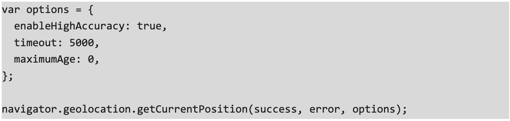

Every software developer now faces a double debt: a technical debt and an ecological debt. This refers to the future costs of rework that will be required if a suboptimal solution is chosen over a better approach for Software Carbon Intensity (SCI). Hence, the task of a software sustainability developer is to write code that passes a certain level of green quality before being delivered.

[<u>State of Green Software</u>](https://stateof.greensoftware.foundation/) highlights some difficulties software practitioners face in making green software a reality. Tackling software carbon intensity at the code level puts developers at the center of the climate tech movement–it is their job to review the codebase carefully to fix code structures that smell bad for energy efficiency and beyond–code smells act on more than energy, like the support of aging devices, which reduces embodied carbon emissions. By minimizing green code smells, we not only enhance the quality but also expedite the repayment of ecological debt.

# Green code smells in the wild

Green code smell can be [<u>defined</u>](https://ceur-ws.org/Vol-3413/paper2.pdf) as follows:

*“Green code smells, also known as green anti-patterns, are poor design or implementation choices that affect the carbon footprint of the program.”*

Green anti-patterns and structures are a real problem. The work to identify them has only just begun. In this respect, the “everything-as-code” trend is a huge call to action. One can view green code smells as the low-level siblings of the [<u>Green Software Patterns</u>](https://patterns.greensoftware.foundation/). Most are waiting to be found in official platform and API documentation. 

To illustrate, here's one green code smell per major domain - Web, Mobile, and Ops - that can be reported as an issue to the developer.

## Green code smell for Web API

Acquiring geolocation of the user through the browser is commonplace in modern-day websites with this simple Javascript statement: 

Geolocation.getCurrentPosition() has an options parameter, including enableHighAccuracy. If True, the application will receive the best possible results but increased power consumption.

## Green code smell for Android

The release of Android 14 is a reminder that each new version of the OS improves apps' energy management. Unfortunately, a developer can still ask to programmatically opt out of the built-in optimization mechanism with a basic element in the manifest.xml file**:**

## Green code smell for Docker

Often the same image needs to be rebuilt over and over again with minor changes to the code. Docker helps with this by caching each layer of a build. Because of this concept, it's a bad practice to add the lines used to install dependencies and packages later in the Dockerfile, that is, after the COPY commands:

# When code quality tools turn green

Static code analysis tools are a fundamental part of managing technical debt. They can work directly in your favorite IDE (aka linters) or be plugged into the CI/CD pipeline. The next logical step is that these widespread tools also help developers detect green code smells in an automated way, which is practical since the code smells mentioned above are statically detectable. Most of the time, green code smells can be fixed locally by the developer, but sometimes they can lead to global refactoring.

Existing initiatives include the [<u>ecoCode open source project</u>](https://github.com/green-code-initiative/ecoCode), which provides extensions for SonarQube, or the new detection category in the proprietary product CAST Highlight ([<u>read the article on GSF</u>](https://greensoftware.foundation/articles/detecting-green-impact-in-source-code-meet-greg-rivera-vp-of-product-at-cast)). But we can also imagine doing the same with CodeQL to integrate green quality analysis into github repositories directly. In any case, the systematization of green coding is essential across billions of lines of code, and only a tool of this kind can accomplish such a task.

# Acknowledgments

Special thanks to the members of the [<u>Green Code Initiative</u>](https://github.com/green-code-initiative), a non-profit organization fostering developer-centric, open source tools for greener software.
