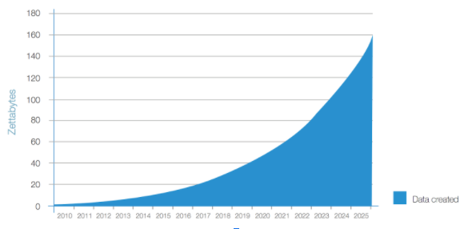
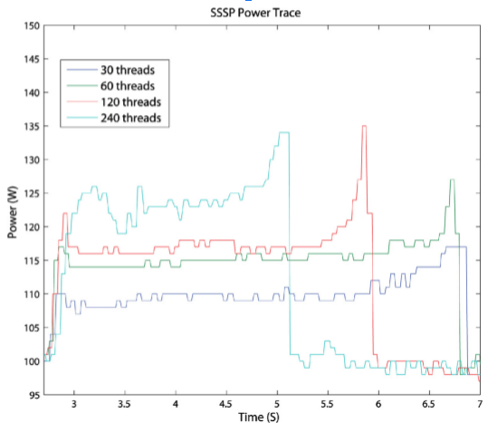

Energy efficient computing is big business. With data centers now at 2% of all US energy consumption in the US, it is fair to say that cutting energy bills is a top priority for all major tech companies. Since 2011 we have seen admirable improvements in data center efficiency with consumption increases dropping from 25% from 2005-2010 to 4% from 2011-2014 currently. (Note that current trends depend on current throughput and consumption trends to stay consistent)

 

<figure>

<figcaption><em>Data center electricity consumption and savings  from the US Department of Energy, Lawrence Berkeley National Laboratory</em></figcaption>
</figure>

This trend has been driven largely by super-efficient, hyper-scaling centers from the likes of Google, Amazon, and Facebook, built from the ground up to be as thermally efficient as possible; as well as widespread industry adoption of server virtualization technology and better job schedulers. The low hanging fruit, however, will soon all be taken. 

Server virtualization is here, and it is hard to imagine another magic bullet solution like it to come along soon, as latency and other demands place upper bounds on just how much utilization a server can reach for web applications. The number of companies that are able to migrate to platform as a service data centers are dwindling. And hardware manufacturers continue to struggle in their downhill fight against Moore’s law. In view of all this, we will have to look to new avenues to keep up with consumer demand.  

## Big data becomes huge data...

This period of 1-3% growth in yearly data center energy consumption could also come crashing to a halt as what we call big data becomes huge data. By 2025 we will be creating more data in one year than in all of previous recorded history. Quickly, 4k and 8k streaming may become the norm. And 5G networks will allow mobile users to consume more data than ever before. Power hungry deep neural networks will be rolled out to an increasingly wider range of applications.

<figure>

<figcaption><em>Data created in zettabytes from 2010 to 2025 (estimated); Source: IDC’s Data Age 2025 study, sponsored by Seagate, April 2017</em></figcaption>
</figure>

If you are committed to energy efficient computing for the future and sustainable growth of infrastructure and capacity, it becomes clear that hardware and data center design alone will no longer be a long-term solution. Software efficiency must be a primary pillar in achieving these goals. 

## Software energy efficiency calls for measuring tools

To improve software energy efficiency, we would have to measure it accurately first. However, measuring software energy consumption is not an easy task. To understand energy characteristics, you need to know not only how much energy a program consumed, and how long it ran, but how each component was being used. These measurements should also be made as easy as possible and support a wide variety of tools and languages.

## Enter The Marcher

All of these factors were the motivation for creating the Marcher system. We wanted to create a platform to help developers, researchers and students study the energy efficiency of their code. And we wanted the devices to be equipped to measure the kind of workloads seen in industry—such as for deep learning and big data processing—as well as in typical high performance computing systems like in the clustered parallel processing of batch jobs.

With funding from the [<u>National Science Foundation</u>](https://www.nsf.gov/) (NSF), we have built our custom systems with two Intel Xeon processors, a Nvidia GPU compatible with CUDA, and an Intel Xeon Phi coprocessor, 32 GB of DDR3 DRAM, one 160 GB SSD and one 1 TB HDD.

The system supports 20+ popular programming languages including C/C++, Python, Java, CUDA and C#. 

To facilitate ease of access and use we have provided what we call Power Profiling as a Service (PPaaS) allowing users to submit and run code directly in-browser through [<u>GreenCode</u>](http://greencode.cs.txstate.edu/).

In addition to this cloud service, for processes which require multiple nodes or longer capture times, we have also built robust command line tools users can access over ssh after applying for credentials.

The power profiling of the CPUS, GPUs, and Xeon Phis are handled by the Intel RAPL interface, the NVIDIA NVML interface and the Intel MICAccessAPI respectively. For all other components that do not have built-in sensors—such as Solid State and Hard Drives—we developed external power sensors called Power Data Acquisition Cards (PODAC). This collection of profiling tools allow us to find in a fine granularity how much power a program is consuming from each component at any given time.

<figure>

<figcaption><em>PODAC connected to a Marcher server</em></figcaption>
</figure>

And here's the [<u>**Marcher System**</u>](https://greensoft.cs.txstate.edu)

<figure>

<figcaption><em>The Marcher System</em></figcaption>
</figure>

Between the web and command line interfaces sits our custom power profiling and job scheduling layer which dispatches jobs, as well as collects, aggregates, performs calculations and saves power data.

<figure>

<figcaption><em>The workflow of job scheduling and power profiling</em></figcaption>
</figure>

## Examples of measurements with the Marcher System

As mentioned earlier, we wanted these systems to be able to measure power for real-world use cases. Here are several examples of measurements taken with the Marcher system.

### Example 1 

Here we see power data obtained from a Xeon Phi coprocessor running the Single Source Shortest Paths (a.ka. Dijkstra’s algorithm) OpenMP program on a single Marcher node.

<figure>

<figcaption><em>Power data from a Xeon Phi coprocessor running the SSSP OpenMP program on a single Marcher node</em></figcaption>
</figure>

### Example 2

The following graph shows the power data collected on two marcher nodes running an MPI-2007 benchmark application.

<figure>

<figcaption><em>Power data on two Marcher nodes running an MPI-2007 benchmark application</em></figcaption>
</figure>

### Example 3

This graph plots the real-time power consumption data of CPU, DRAM, and GPU when training the AlexNet with Caffe on a Marcher server.

<figure>

<figcaption><em>Real-time power consumption data when training the AlexNet with Caffe on a Marcher server</em></figcaption>
</figure>

Marcher provides easy to use tools for fine grain software energy profiling, which empowers developers, students, and researchers to learn more about the energy consumption of their software. It provides Power Profiling as a Service through both web-based and command line interfaces. If you would like to read more details about the development of the Marcher system, [<u>read our paper here</u>](http://greensoft.cs.txstate.edu/wp-content/uploads/2018/05/journal_of_big_data.pdf). 
