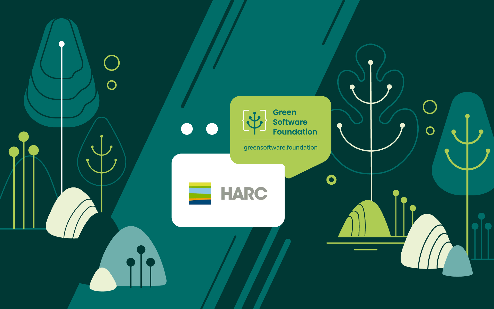

Carlos Gamarra joined Houston Advanced Research Center (HARC) in 2017 after a fulfilling career as an energy engineer in Spain. His work involved designing and constructing industrial plants and renewable energy-based power plants. Now, he leads HARC’s efforts to provide end-to-end research, technical assistance, and customized decision-making solutions. He also serves as the energy manager for their building, the first certified net zero commercial building in Texas.

# Can you highlight your organization’s work toward tackling environmental challenges?

HARC is a nonprofit research hub that provides independent analysis on issues related to energy, air, water, resilience, and climate equity. Our research activities support the implementation of technologies that promote sustainability based on scientific principles. We apply science to drive solutions for a sustainable and equitable future, and several of our projects respond to climate change impacts through resilience planning for underserved communities throughout Texas and elsewhere. We work with all levels of government, the private sector, academia, philanthropy, and communities to create and implement solutions that can be reproduced and scaled across the country.

HARC leads several research, innovation, and technical assistance projects that are funded by various federal agencies such as the US Department of Energy (DOE), the Environmental Protection Agency (EPA), and the USDA’s Forest Service, as well as several state agencies like the Texas Commission on Environmental Quality (TCEQ), and local entities such as the City of Houston and its various precincts. We also provide consulting services related to net zero buildings, energy efficiency technology, nature-based solutions, and a variety of other sustainability initiatives for corporate entities and private companies. Our projects have included the development of software and virtual reality applications.

# What’s the relevance of sustainability at HARC?

Sustainability is our passion and our mission. Everything we do is grounded in sustainable development and finding ways to protect our current natural and environmental resources for future generations. We want to create the right solutions to protect our planet’s resources and bring equitable benefits to all communities, particularly underserved communities. Our approach is hands-on research, innovation, and program implementation. We plan to continue walking the net zero energy path and showing other organizations how to follow suit. 

# What is your main goal with regard to sustainability?

One of my main goals at HARC is to help private companies and public entities decarbonize their operations, including commercial and industrial applications, and the power grid. We use HARC’s building as an example of how to decrease carbon emissions beyond the net zero status; a milestone we met in 2019. Our building was the first commercial building in Texas to be certified net zero, which means it produces more energy than it consumes. The building is also certified LEED Platinum, certified LEED Zero Energy, and Energy Star rated 99/100 – a ranking we just received for the fifth year in a row.

Another goal is to keep testing and using new technologies to further advance sustainability. The more we learn, the more we can share with other organizations. 

# Why did you join GSF?

We know that there has been an exponential growth in energy consumption in the computing and software fields. As technology grows and expands, from AI to IoT, and is used by more people, more energy is consumed and more will be required. We want to apply our current expertise and knowledge regarding decarbonization – and expand our knowledge and skills through working with and learning from partners in GSF – to see how we can support decarbonization efforts in the software and computing sectors. It’s a sustainability-related challenge that we’re interested in working on, to see what we can learn, what we can teach, and how we can together create workable and effective solutions to the problem.

# Will you be actively contributing to the GSF?

Absolutely. We believe in the mission and vision of the organization, and we want to help bring that to life with a collaborative approach. We’re interested in the Open Source and the Community working groups. We’re also planning to research, evaluate, and implement the tools GSF provides with the aim of applying green software engineering principles to enhance sustainability and decarbonization across various industries. We want to play a role in developing and sharing case studies and lessons learned from our projects in an effort to accelerate the development of new solutions for green software.  

# Are you applying any principles of green software development in your organization? 

Yes, our organization is actively engaged in green software engineering. We're in the process of creating a digital software tool for the US Department of Energy (DOE) aimed at achieving zero carbon emissions. This is distinct from achieving net zero, where carbon emissions are offset or neutralized. Our goal is to develop a tool that does not emit any carbon at all. It's a challenging objective, but we are committed to it and expect to release the product later this year.

# That sounds like an exciting project. What are the challenges?

The tool operates from on-premise servers, which brings both benefits and challenges. A significant benefit is our ability to power these servers using clean energy generated by our own rooftop solar panels. We strategically schedule computations for times when there is surplus solar energy, ensuring the operations are carbon emission-free. However, one of the challenges we face includes potential delays in running analyses. These delays are more likely if tasks are submitted late in the day or during inclement weather, such as rainy days. Delays can negatively affect the user experience.

# How do you work around that?

To address potential delays, we give users the option to choose a zero-carbon analysis. This means they are made aware that the timing for the results may vary depending on solar energy availability at our premises. To minimize wait times, we're exploring an alternative strategy that allows users to specify a timeframe for when they would like to see their results. If necessary, to meet these deadlines, we would use conventional grid electricity to complete the job within the requested timeframe.

# What is HARC's vision for the evolution and impact of green software in the coming years?

There has been significant growth in sustainability initiatives in several sectors over the last few years. We believe that software, hardware, and computing in general will join in that movement and begin to more actively consider how to apply sustainability principles, both at the design and operation stages. We look forward to seeing that and we want to play an effective role in helping to initiate it and provide solutions. 

# What are the primary obstacles to advancing green software?

The foremost hurdle to the progress of green software is the lack of awareness. Many people do not realize the environmental impact of software, a staple of daily life, which makes it difficult to grasp its potential harm. Establishing methods to evaluate the sustainability of software design and usage could significantly aid in understanding these impacts. Introducing a certification similar to the EPA's Energy Star program could elevate awareness and encourage both developers and users to opt for greener choices in their software decisions.

# Which other sustainability initiatives are you working on?

HARC leads a variety of sustainability-focused projects. Our Energy team leads a technical assistance program on clean energy generation and storage for the DOE. The team also develops feasibility analysis tools for clean energy generation for the State Energy Conservation Office (SECO) of Texas. We have worked with the City of Houston and are helping Harris County in the development and execution of their Climate Action Plans. 

We are also partners in the HyVelocity Gulf Coast Hydrogen Hub, a project slated to be funded by the DOE at up to $1.2 billion, on the community engagement and community benefits plans. And we’re currently leading a residential weatherization program for disadvantaged communities, and working on a multi-year project that would result in providing solar for those communities. 

