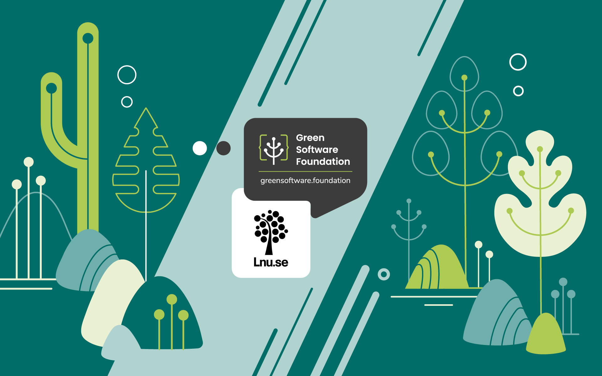

Mauro is a full-time professor in the Department of Computer Science and Media Technology at Linnaeus University (LNU). Before moving to Sweden, he was a Postdoctoral Researcher at INRIA Paris-Rocquencourt, France, and an assistant professor at the Politecnico di Milano, Italy. His research interests mainly focus on applying Software Engineering methodologies and techniques to Self-adaptive Systems, particularly emphasizing decentralization and resiliency.

## Can you give us an idea about the field of the university?

Linnaeus is an international university located in Växjö and Kalmar, Sweden. It offers over 200 degree programs and 1500 single-subject courses spanning different subjects within arts and humanities, health and life sciences, the social sciences, the natural sciences, technology, business, and economics.  LNU excels in high-quality research, across a diverse spectrum of disciplines. from ecology and evolution to discrimination and integration, postcolonialism, intermediality, bioscience, and big data.

## How would you describe the focus on sustainability?

LNU promotes sustainable excellence and supports research and educational initiatives encompassing a holistic understanding of sustainability and its pivotal role in society and industry. Such initiatives take a comprehensive and interdisciplinary approach, involving collaboration within various disciplines and external partners. We profile ourselves by developing our ability to disseminate and, in partnership with the business sector, utilize knowledge that significantly and consistently contributes to sustainable societal development. In this context, my goal is to investigate and educate about sustainable computing, including green software principles and practices.

## How do you see green software?

Despite the great interest in sustainability, the public is often unaware that the software we use every day, including AI, cryptocurrencies, and audio, video, and gaming streaming services, accounts for a large part of carbon emissions. We are convinced that we need a paradigm shift in how we design and operate software. We want to promote green software through research projects, education, and third-stream activities.

## Give me some examples

Concerning research, we continuously have new projects where we investigate and develop new ideas together with BSc/MSc/PhD students.  Our current initiatives include:

- Developing a test bed with a solar-powered web server and solar-powered websites
- Exploiting ML/AI for predicting the energy consumption of Java programs
- Reducing the energy consumption of Behavioural Software Design Patterns

In education, we want to include green software concepts in our BSc/MSc courses, such as Software Engineering, Software Architecture, Programming, Algorithms, and Machine Learning. Beyond academia, by participating in the media and organizing special events such as workshops, lectures, and seminars, we plan on doing our part to ensure sustainability and green software feed into the non-academic communities.    

## How do we succeed in reducing emissions?

By having a sustainability perspective on software development and usage, we can reduce our environmental impact and contribute to a better future. We aim to be at the forefront of research by turning sustainability from an afterthought, as is the current practice, to being a primary and integrated requirement for software. For this to work, cooperation between industry and academia is vital: enterprises are constantly developing operational capabilities, whereas universities have theoretical and model-based knowledge and competencies. Together, we can provide opportunities for innovating the software industry and driving the green transition.

# Which role do principles of green software engineering and development play for you?

I have included green software engineering principles in two different courses, namely “Software Design” and “Project Course in Software Engineering”. The idea is to introduce students to sustainability issues related to software design, development, and usage, and provide them with some possible solutions, i.e., principles, patterns, and tools such as [<u>Carbon Aware SDK</u>](https://github.com/Green-Software-Foundation/carbon-aware-sdk), and [<u>Green Software Maturity Matrix</u>](https://github.com/Green-Software-Foundation/green-software-maturity-matrix/blob/dev/docs/history.md).

## Why join the GSF?

We want to be part of the climate solution, and joining the Green Software Foundation is an important step towards that goal. I look forward to contributing to the Open Source Working Group and to Green Software Patterns. 

## There are some obvious challenges; how do we push past them?

In current software development projects, sustainability is usually treated as an afterthought, i.e., as a desirable quality of the system to be considered if, and only if, other economic-centered requirements are successfully addressed (e.g., time-to-market, performance). Rather, sustainability should be the default primary requirement, independent from the specific purpose of the system. 

Our approach at Linnaeus is that software needs to be designed from the ground up to be green and able to reconcile the three distinct and typically conflicting aspects: 

(1) **efficiency**: the ability to limit energy consumption, 

(2) **longevity**: the ability to live long and prevent hardware obsolescence, and 

(3) **efficacy**: the ability to meet the users’ expectations (e.g., performance, business needs).

# LNU has some exciting sustainability initiatives outside of IT. Can you give us a few examples?

Sustainability is deeply ingrained in the fabric of LNU. We are currently involved in many different initiatives. Here’s a short selection: 

- [<u>https://lnu.se/en/meet-linnaeus-university/a-sustainable-university/</u>](https://lnu.se/en/meet-linnaeus-university/a-sustainable-university/) 
- [<u>https://lnu.se/en/meet-linnaeus-university/current/events/2024/conferences/young-researchers-conference-in-green-sustainable-development/</u>](https://lnu.se/en/meet-linnaeus-university/current/events/2024/conferences/young-researchers-conference-in-green-sustainable-development/)
- [<u>https://lnu.se/en/meet-linnaeus-university/collaborate-with-us/international-collaboration/the-european-university-for-well-being/</u>](https://lnu.se/en/meet-linnaeus-university/collaborate-with-us/international-collaboration/the-european-university-for-well-being/) 

