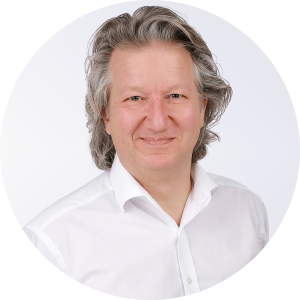

New Green Software Foundation member [<u>Syngenio AG</u>](http://www.syngenio.de) is an IT consulting and software development house based in Germany with subsidiaries in seven cities. Since 2001, Syngenio has focused on bringing IT and business departments together, specialising in digital payments, next generation banking, the Internet of Things (IoT) and green software. Syngenio continuously improves its climate impact since 2019 and is climate neutral since 2021.

In this interview with Jürgen Funke, a technology enthusiast and Board member at Syngenio, we discuss Syngenio’s plans with the Green Software Foundation and why green software is a key consideration for the company and its people. 

## Tell us about yourself and your work at Syngenio 

As a technology enthusiast, I always strive to make technology work in a meaningful way. I joined Syngenio nearly 14 years ago and today I am the board member responsible for marketing, corporate development and our start-up platform. At Syngenio, we optimise business processes of banks and other service providers with innovative IT solutions. The start-ups we co-founded give us access to specific technologies such as IT Security, Virtual Reality, Distributed Ledgers and applications for IoT. These technologies supplement our core offerings but are better off as separate companies.

Personally I live with my family in the Cologne area and from time to time you will find me in the Provence, where other parts of my family reside. Starting with an apprenticeship as a radio-television technician, I studied electrical engineering with a focus on computer science and got to know and appreciate the diversity of the IT consulting industry. Finding the best solutions, implementing them and making them work are still my driving force today. I was allowed to experience this at large IT companies operating internationally. Seeing my own children grow up in Paris for a while was also an enrichment for the whole family.

## What is your interest in green software and your journey to GSF? 

Working in one's own competence area is where everyone can contribute specifically to the climate challenge. We, at Syngenio, know how to develop software. Therefore, green software is the field where we can be the most productive at. So we start here, at the root cause of emissions caused by IT and not just at seeking a remedy for the symptoms.
I am convinced that Green Software Design will become as important as Test Driven Development and Secure Coding. Within five years, it will be unthinkable not to include sustainability aspects into software development projects.

Last but not least, the regulatory requirements for managing emissions, especially in highly regulated markets such as the financial industry, will increase massively in the next few years. This, too, will add momentum to the green software movement.  

## What do you expect to achieve by working with the GSF and in green software in general? 

Expert exchange at all levels of competence will be invaluable. A design thinking approach is also highly welcome. We can work on generating awareness in the IT industry and among its customers for the relevance of the topic.

I am also convinced that ecology and economy do not exclude each other, but depend on each other. To this end, I would like to exchange ideas with the GSF community and translate them into concrete recommendations and solutions for software engineers.

## What GSF activities are Syngenio involved in? 

We currently participate in three working groups: Standards, Policy and Community. We are currently making up our minds on which projects to participate in. I personally will not join working groups directly, but rather support our team in their contributions.

## Is Syngenio using principles of green software engineering and development in your work? 

Yes. In early 2021, Syngenio established a dedicated team that explores *Green Software Design*, as we call it. We want to give development teams advice on how best to get started. Analysing existing frameworks, libraries and products plays an important role here because in many software development projects, the lines of code imported from such frameworks exceed the newly written code by far. But we also work on principles and process improvements that support *Green Software Design*. 

## What obstacles do you see to using green software on a wider scale within your organisation and in general?

One major obstacle simply seems to be that you have to do it on top of everything else. There’s enough work to be done already, and now we want the teams to take green software aspects into account too. Small wonder they act reserved.

But there is a more basic issue. Today, hardly any software engineers know how to develop software in a greener way. They simply don’t know where to start. There is a major lack of know-how across the entire industry. 

## How do you think we can overcome them? 

As far as the additional workload is concerned, there are two measures. One is automation. When tests for power consumption are automated and included in the CI (continuous integration) chain, they don’t require additional effort. 

The second factor is even more important: Product Owners need to explicitly include greenness as a project goal. Let’s treat it the way we treat security, as a non-functional requirement that is always part of every development project. This way, developers can focus on resource efficiency as part of their normal work. And since it is an interesting challenge to address, most of them are quite keen to do it.

There are many reasons why Product Owners really should include greenness as a development goal. The increasing demand for sustainable products in general is not the least of these. Customers are actively looking for sustainability when choosing products and they will soon begin to check apps and websites and basically any software as well for sustainability. This is why we created the [<u>*Green Software Design Label*</u>](https://www.greensoftwaredesign.com/en/green-software-design-label/) which allows customers to identify green software. It can be obtained by following the recommendations from our web-based tool, the [<u>*Green Software Expertyzer*</u>](https://www.greensoftwaredesign.com/en/expertyzer/)*.*

This brings us to the second obstacle we need to tackle: The lack of knowledge. To support teams getting started on green software, we created the *Green Software Expertyzer*. It includes known factors and measures that lead to more efficient software. You can think of it as a question-and-answer tool that shows where you stand with your software and how to improve it. Expertyzer is limited to web- or app-based multilayered applications for now, because that is our main area of expertise. 

## How can companies get more young software engineers onboard the green software movement?

Today, many software engineers include sustainability into their lifestyle, especially young talents. And since all developers are keen on exploring leading edge tech, let us give them tools to measure and improve their code. Let us turn it into a challenge: Who is best at developing resource efficient software? Some kind of focus point might be useful as well. Maybe a *Green Manifesto*, like the [<u>*Agile Manifesto*</u>](https://agilemanifesto.org/).      

## What can the Green Software Foundation do on that front?

Oh, lots of things! That’s why we are so enthusiastic about joining. Creating, collecting and spreading knowledge, for one. Coordinating the development of tools; raising awareness that green software is on the move and that it is the only way to go. Supporting local tech communities like the [*Green Software Design Community*](https://www.greensoftwaredesign.com/en/gsd-our-members/) we just started in Germany. There’s really no end to things that should and can be done, especially when more members get on board.

## Any other matters you would like to share with us about green software and sustainability?

I would like to answer with a quote:

> "As for the future, our task is not to foresee it, but to make it possible."
> ~ Antoine de Saint-Exupéry

Green Software addresses the root cause of emissions caused by IT. We can and want to make a contribution to this endeavour. Together with the initiators and members of the GSF, this will give carbon reduction an enormous boost and have a real impact.
