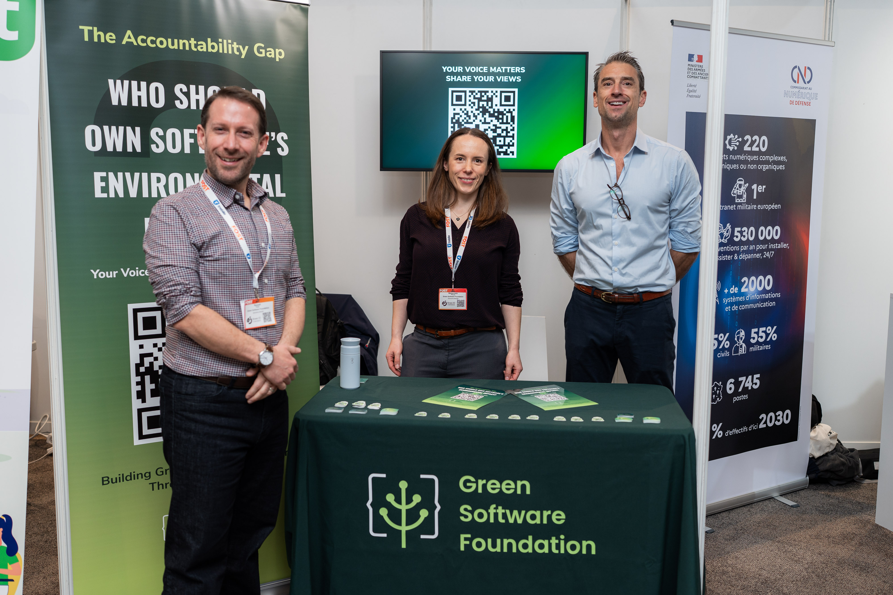
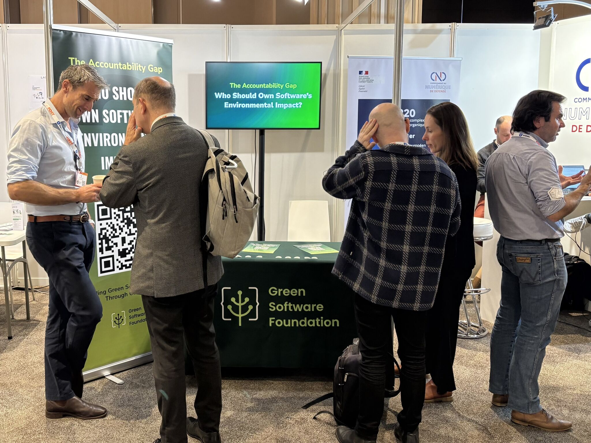

In December 2025, at the Green IO Paris conference, practitioners joined [GSF's first public consensus Assembly](https://greensoftware.foundation/articles/the-accountability-gap-who-should-own-software-s-environmental-impact) to answer one of green software's most persistent questions: **who should own software's environmental impact?** We expected a debate; instead, they gave us a solution to act on.

Beyond the findings, the Assembly methodology delivered a consensus-based solution in a few days, validating the approach we're now piloting with our members to develop software and hardware standards in weeks instead of months.

In this report, we share key findings, what they mean, and the methodology that helped us get here.

## The Discovery

Instead of picking a side in the long-running debate between dedicated sustainability teams and distributed responsibility, practitioners converged on something neither camp had proposed: a phased model where dedicated teams are temporary by design, building organizational capacity and then deprecating themselves as sustainability becomes part of everyone's roles.

One participant put it this way:

> "I think initially dedicated teams within organisations are required to kickstart the sustainability efforts. This team can gather and spread information and workflows to help others outside the team understand the potential impacts. (...) Eventually, this would lead to a deprecation of this team as it is not required anymore."

This outcome didn't come from a single voice or the questions we asked. Practitioners from different organizations, roles, and countries arrived at the same solution through two rounds of structured debate. The binary question dissolved when they added a time dimension: both positions are right, depending on organizational maturity.

## The Problem

Software's environmental footprint continues to grow, not because people don't care, but because the system isn't designed for organizations and practitioners to act on it.

As one participant explained:

> "People generally want to do the right thing. They are simply under pressure to ship, to hit deadlines, and to keep up with demand."

The barriers are baked into how organisations work.  First, most don’t have visibility into energy consumption at the level where engineering decisions happen. Second, delivery pressure leaves no room for sustainability work. And third, the people who report on emissions are disconnected from those who could reduce them.

## Research Validation

Assembly participants aren't alone in identifying these problems. Görücü, Ren, Samuel, and Panagiotidou ([2025](https://dl.acm.org/doi/10.1145/3715275.3732088)) interviewed 23 ML practitioners and revealed the same core dynamic: practitioners care about sustainability but feel powerless to act on it. One of their participants echoed what our process surfaced: "As an individual, I suppose you can't really do much."

The researchers identified a lack of agency at the heart of the AI and sustainability conversation. Despite the existence of eco-feedback tools and growing awareness of environmental impacts, practitioners expressed feeling their industry didn't value sustainability, and that individual action wouldn't matter.

Both studies point to the same thing: there is a need for structural change in how organizations assign responsibility, and practitioners themselves already know what that structure should look like.

> [!NOTE]
> **Reference:** Görücü, S., Ren, Y., Samuel, G., & Panagiotidou, G. (2025). Environmental Sustainability Perceptions of Machine Learning Practitioners. *Proceedings of the 2025 ACM Conference on Fairness, Accountability, and Transparency (FAccT '25), 1312-1324. DOI: 10.1145/3715275.3732088*

## The Phased Framework

The solution Green IO participants converged on follows a three-phase model. Before we share why, here's the objection.

One participant was blunt:

> "It should be everyone's role. Separate roles often end up with tokenistic responses and 'oh go speak to our green guy'."

Another noted:

> "Creating dedicated roles will add friction and people will not be as concerned as they should."

While they’re not wrong, others pointed out the opposite risk: when sustainability is everyone's responsibility, no one is accountable. Someone described the need for:

> "A cleanup crew, a dedicated group focused on the areas with the highest footprint... Their work would not replace engineering teams but rather support them by identifying where improvements matter most."

The phased model resolves this by making dedicated teams the mechanism for reaching distributed responsibility.

### Phase 1: Dedicated Teams Launch Efforts

Organizations create focused sustainability teams whose explicit mission is capability-building, not permanent ownership. They:

- Establish measurement frameworks and workflows
- Instrument systems to surface environmental impact, where technical decisions are made
- Identify high-impact areas—the services or pipelines responsible for the bulk of the environmental footprint
- Demonstrate initial improvements that build the case for broader adoption

This requires direct leadership support. As one participant pointed out:

> "Dedicated efforts would need explicit support from the board. Without that kind of sponsorship, sustainability remains optional."

### Phase 2: Knowledge spreads through evidence

Initial wins become the catalyst. When a dedicated team can show that a specific optimization reduced energy consumption by a measurable amount, that evidence travels.

- Sustainability trade-offs start appearing in code reviews and design decisions because teams have seen it work
- Sustainability metrics integrate into existing dashboards and KPIs, alongside the performance and cost data that teams already watch
- Teams outside the core group begin making sustainability-informed decisions independently

As one participant put it:

> "It will eventually become a standard to have certain knowledge about the impact of your software in all kinds of roles."

### Phase 3: The dedicated team deprecates itself

The team's success metric is making itself unnecessary.

- Transition criteria are defined from day one: "when X% of teams incorporate sustainability into code reviews" or "when sustainability appears in Y leadership KPIs"
- Senior leadership is assessed on sustainability outcomes alongside financial performance
- Environmental impact becomes a standing item at the board level

This is where the objection gets answered. Critics warned that separate teams lead to tokenistic outcomes:

> "Rather than having separate 'green' owners, incorporate green targets into all senior leaders' KPI framework. This would mean senior staff are judged on the sustainability of their outputs and will create team dynamics focused around that... It should be everyone's role, separate roles often end up with tokenistic responses and 'oh go speak to our green guy'."

The phased model doesn't end with a permanent green team. Instead, it creates a culture in which sustainability is integral to every role and responsibility.

## What We Found

Alongside the phased framework, four themes emerged with strong practitioner consensus:

**Responsibility is already distributed. The problem is visibility.** Every participant independently identified multiple stakeholders who shape software's environmental impact: engineers, platform teams, product owners, cloud providers, and leadership. This wasn't contested. What's missing is instrumentation, which means making environmental impact visible at each decision point where it's already being determined.

> "When I think about the environmental impact of software, I do not picture a single owner. I think of the people whose decisions shape how systems behave once they are in production."

**Standardised measurement frameworks are prerequisites, not nice-to-haves.** Without common standards, every organization reinvents measurement in isolation. Comparison becomes difficult, knowledge can't spread, and tools get built multiple times for the same purpose.

> "An open framework for a standardized way to measure and report sustainability is a key part in my opinion for broad adaptation of these practices... generalised standards and tools could really help in this regard."

Participants identified it as a prerequisite for making distributed responsibility work.

GSF is already applying this principle: [the Software Carbon Intensity (SCI) for Web specification is currently being developed](https://greensoftware.foundation/articles/designing-sci-web-what-we-agreed-and-what-comes-next) through an AI-supported Assembly, translating practitioner input into a shared measurement standard for web applications.

**The top-down vs. bottom-up debate is a false choice**: Some practitioners emphasized executive accountability through KPIs and regulatory pressure. Others focused on team-level cultural shifts through code reviews and design decisions. Both camps agreed that both levels matter, but they disagreed on sequencing. The Assembly outcomes suggest running them in parallel: use early team wins as evidence to build executive commitment, and use leadership support to protect team-level experimentation from being deprioritized.

> "Some kind of mindset change is required for management to make sustainability among the highest priorities of the organisation... This should be incentivised by law."

**Leadership commitment is the structural enabler.** The deeper theme across every response was about what organizations measure and prioritize. Better algorithms and more efficient infrastructure are important, but to succeed, they need changes to power structures and incentive systems. What leadership treats as strategic determines what changes.

## Methodology

### How we got here: AI-supported consensus process

Consensus is how GSF develops standards. Getting dozens of organizations, from hyperscalers to NGOs, to agree on a standard such as the Software Carbon Intensity (SCI) specification typically takes months, if not years, of deliberation in closed working groups. We've been refining an AI-supported process to do this faster without losing the rigour.

[The Green IO Paris Assembly](https://greensoftware.foundation/articles/the-accountability-gap-who-should-own-software-s-environmental-impact) was the first time we tested this approach outside of GSF membership.

This three-day Assembly generated 87 distinct practitioner positions across two rounds of structured debate, synthesised with full representation tracking; traditional standards processes take months to surface that kind of structured convergence.

### What we did: Four-stage process

Over three days, we ran a consensus-building session with 12 participants at the Green IO Paris conference. This sample produced multi-thousand-word responses and enabled depth that made the phased framework possible.

**Round 1** posed three open-ended questions: who should be responsible for software's environmental impact, who currently makes those decisions, and what gets in the way. Participants responded with comprehensive answers ranging from 7,286 to 12,381 characters.

AI synthesis then processed every response equally. The model extracted 42 distinct positions across 14 thematic areas, categorising each as a core position, implementation detail, nuance, or dissenting view. It mapped where participants agreed, where they diverged, and, critically, where tensions sat that hadn't been addressed.

**Round 2** shared the synthesis back to participants and drilled into the sharpest tension: dedicated sustainability teams vs. distributed responsibility. Six participants responded, generating 45 additional positions across 11 themes.

**Final synthesis** integrated both rounds, tracking how positions evolved and whether the phased framework that emerged genuinely addressed the concerns raised by both camps. Representation analysis showed 62% of positions fully adopted, 11% partially adopted, and 11% explicitly acknowledged in disagreement sections.

### Why AI

Traditional consensus processes force a trade-off: limit participation to keep the discussion manageable, or open it up and lose coherence. AI synthesis breaks that constraint and lets us process every participant's thinking without losing the outliers: minority positions are tracked and preserved in the final output. The synthesis emerged from tension and disagreement, not despite it.

Participants did the thinking. The AI made it possible to hold all of that together, find where they converged, and be honest about where they didn't.

Using this approach to develop the SCI for Web specification has demonstrated that the methodology works for open practitioner consultation and technical standard development.

## What We Learned About the Process

The Assembly provided insights that will inform how we evolve AI-supported consensus:

**Depth over breadth produced better results than expected.** Twelve practitioners generating detailed written responses surfaced more actionable insight than a poll of hundreds might have. The phased framework emerged because participants had space to think through contradictions rather than pick from pre-set options, providing written responses of 7,000+ characters.

**Response quality varied enormously.** The most comprehensive single response contributed 45% of all Round 1 positions. Future assemblies might benefit from better scaffolding: structured prompts that help all participants articulate their thinking at comparable depth, without constraining what they say.

**AI synthesis surfaced tensions that a facilitated discussion might have missed.** The dedicated-teams-vs-distributed-responsibility tension was visible in Round 1 responses, but participants hadn't directly engaged with each other's positions. AI mapping made the tension explicit and gave Round 2 something concrete to push against. The phased framework emerged from that push.

**The email format worked, but with limited iteration.** Two rounds over three conference days meant limited back-and-forth. A longer process with three or four rounds could test whether the phased framework holds up under sustained scrutiny, or whether it's a first-pass synthesis that needs further refinement.

We'll take these lessons into planning for future assemblies, either publicly or within GSF working groups, testing how we can maintain the same quality of insight at larger scale.

## What This Means for GSF Members

### For practitioners

The phased framework gives us something concrete to propose: start with a dedicated team to build capacity, define transition criteria, and plan for the team's deprecation as sustainability becomes embedded.

Don't wait for that proposal to get approved. Start where you have agency: bring sustainability into code reviews or instrument the systems you own. Then document your findings for everyone to share. When you can show a specific change that reduced consumption by a measurable amount, that evidence builds the case for everything else.

### For organizations

Every participant in this Assembly said the same thing: without shared standards, distributed responsibility doesn't work. Organisations reinventing measurement on their own waste resources and can't learn from each other.

The phased framework offers an actionable path forward, but it depends on something that no single organisation can build alone: common measurement standards, shared tools, and collaboration on problems we all face.

## Join the Conversation

Our work is built through consensus; GSF members who compete in the market collaborate on shared measurement challenges. That’s how we built an [ISO-approved SCI standard](https://www.iso.org/standard/86612.html) and trained over 130,000 practitioners.

The findings in this report highlight a need for shared frameworks and cross-organisational learning. GSF offers direct participation in standards development and the consensus process that produces industry-wide agreements.

[Become a member to join](https://greensoftware.foundation/join-us) the next Assembly and help shape how we build and use software and hardware across the industry.
